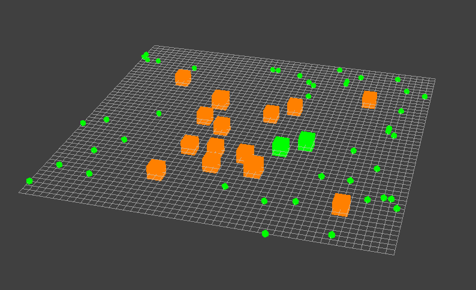
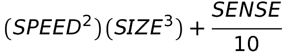

# Basic Natural Selection Simulation

A fun visualization of the natural selection of genes in an environment.



## Project

The project was inspired by [this amazing youtube video](https://www.youtube.com/watch?v=0ZGbIKd0XrM&t=402s) on simulation of natural selection, and implements much of the same ideas. The simulation was made using the [Ursina](https://www.ursinaengine.org/) engine.

The goal is to provide a small and fun simple simulation of natural selection: where organisms with favorable genes for survival reproduce, and those without them die out. Eventually this allows a set of species or an individual to adapt to its environment.

### Environment

The environment in this simulation is using the same *day cycle* described in the video, where during a set period of time (designated as a day), the individuals will roam and find food. Individuals consume energy and thus require food (that replenishes energy). Those that are still alive by the end of the (did not starve) will reproduce an exact copy of themselves. In this case, the *day* is a ticker that when reaches a certain set amount, the day is done and those who survived will carry on.

### Energy

In this simulation every individual (organism) has a set energy level; which is a set integer value. Every single individual regardless of genes has the same energy level at birth. As individuals move around randomly throughout the day, they consume energy at a rate based on their genetics. This formula for energy consumption is identical to that specified in the video, where:

||
| :-: |

**SPEED** is a gene of integer value that dictates how fast the individual moves. **SIZE** is a gene of integer value that dictates how large the individual will be. **SENSE** is a gene of integer value which adds some form of basic intelligence to the individual.

If an individual obtains *food*, the food will instantly replenish a portion of their energy.

#### Genes:

##### Size

Size dictates how large the individual is. The larger the individual, the slower it moves. By looking at the energy cost function, we can see that size is an incredibly consuming gene to have, especially since the individual will move slower and thus have a lesser chance of obtaining an adequate amount of sustaining food in time. However, if a individual is atleast 20% bigger than another individual, the larger individual will be able to eat the smaller individual and gain all of the smaller individual's energy at that instant (provided the two collide).

##### Speed

Speed dictates how fast the individual moves across the environment. Being fast allows for avoidance of larger individuals, as well as retrieving food faster. However, the faster the individual moves the more energy it consumes doing so.

##### Sense

Sense is a radius around the individual (the size of the radius being determined by the integer value of the individual's **SENSE** gene) that allows the individual to detect food or larger individuals that enter the radius. The individual can then either run directly to food, or run away from being eaten. Since the individuals by default move randomly through the environment in hopes of finding food and not being eaten, sense allows for some sort of more intelligent direction and usage of resources.

## Running the Simulation

### Requirements

```Bash
Python >= 3.6
```

```Bash
ursina >= 0.1
dataclasses >= 0.7
```

- Ensure **Python 3.6** or later is installed and working.
- Clone or download the github repository.
    - Under the *basic-natural-selection-simulation* directory run

    ```Bash
    pip install -r requirements.txt
    ```
    - All dependancies will be installed.
- To run the simulation with all default parameters:
    - Under the *simulation* directory run
    
    ```Bash
    python3 main.py
    ```
    - Specific flags may be specified to change or add certain parameters

#### Setting Parameters

Experiment with the types of individuals that survive in your own environment!

| Flag | Type | Default | Description |
| :-:  | :-:  | :-:     | :-:         |
| ```-popsize```| int | 25 | The number of individuals to create in the population |
| ```-foodsize```| int | 1.5 x popsize | The amount of food to create in the environment |

#### Stopping the Simulation

To close the *Ursina* window, use either the red &#10060; in the top right corner. You can also use **command-Q** to quit [RECOMMENDED].
